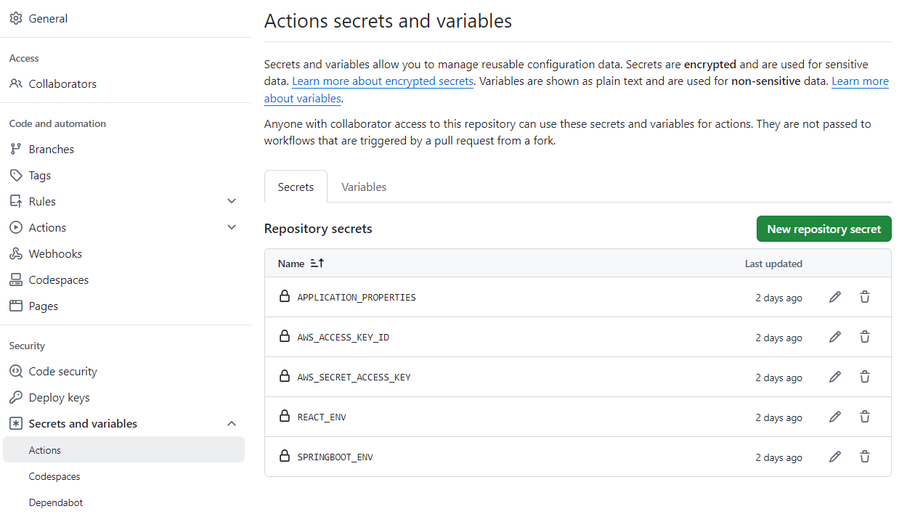

# Docker를 사용한 프로젝트를 AWS ECS와 ECR를 사용해 배포하는 방법 학습

> Initial written at September 29, 2024 <br/>
> last updated at: September 20, 2024


## Current: ver. 1.0.0<br/>
>* ver 1.0.0.
>   * Init: 프로젝트 세팅 ( React + Spring Boot )
>   * CORS 설정
>   * CICD 파이프라인 추가

# 1. 프로그램 (프로젝트) 설명

- 본 프로젝트의 운영체제는 Linux OS를 기반으로 작성되었습니다.
- 본 프로젝트는 Spring Security와 JWT를 고려하지 않은 프로젝트 입니다. ( 추후에 Spring Security를 도입할 경우 Filter와 연결해서 고려할 예정입니다. )
- 본 프로젝트는 CORS 설정의 경우 Backend에서 설정하는 것이 바람직하다고 생각하여 Spring Boot 프로젝트에서 설정을 했습니다.

# 2. Prerequisite

- 본 프로젝트는 Docker를 사용하므로 `.env.template` 파일을 참고하여 `.env` 파일에 환경 변수값을 작성해주세요.
    - root, react-app, springboot-app 총 3가지 파일을 모두 작성해주세요.
    - `HOST_PORT` : 외부에서 컨테이너의 애플리케이션에 접근하는데 사용하는 포트 ( 노출되도 괜찮은 포트 )
    - `SERVER_PORT` : 애플리케이션이 컨테이너 내에서 통신하는 포트 ( 노출되면 안되는 포트 )
    - Vite에서는 보안이 필요한 환경변수의 유출을 막기 위해서 `VITE_`으로 시작하지 않는 환경변수는 무시되기 때문에 `VITE_SPRINGBOOT_HOST_PORT`가 필요합니다.
    - `root/.env`
        ```
        # 예시
        SPRINGBOOT_HOST_PORT=8081
        SPRINGBOOT_SERVER_PORT=8080

        REACT_HOST_PORT=3001
        REACT_SERVER_PORT=3000
        ```
    - `react-app/.env`
        ```
        # 예시
        VITE_REACT_SERVER_PORT=3000
        VITE_SPRINGBOOT_HOST_PORT=8081
        ```
    - `springboot-app/.env`
        ```
        # 예시
        REACT_HOST_PORT=3001
        ```
- 본 프로젝트는 Springboot를 사용하므로 `springboot-app/src/main/resources/application.properties.template` 파일을 참고하여 `application.properties` 파일을 생성해주세요.
    - `springboot-app/src/main/resources/application.properties`
        ```
        # 예시
        spring.application.name=springboot-app
        server.port=8080
        ```

# 3. 구동 방법

## 3.1. 프로젝트 실행

본 프로젝트는 Docker Compose를 사용하므로 이를 실행시켜주세요.

```shell
(sudo) docker compose up (--build)
```

## 3.2 프로젝트 종료

본 프로젝트는 Docker Compose를 사용하므로 이를 실행시켜주세요.

```shell
(sudo) docker compose down (-v)
```

# 4. 디렉토리 및 파일 설명
```
    /CICD_GITHUBACTIONS-ECS-ECR
    ├── .github/
    │   └── workflows
    │       └── CICD.yml 
    │
    ├── docs/
    │   ├── PULL_REQUEST_TEMPLATE.md
    │   ├── README.md
    │   └── secrets.png
    │
    ├── react-app/
    │   ├── public/
    │   │   └── vite.svg
    │   ├── src/
    │   │   ├── assets/
    │   │   │   └── vite.svg
    │   │   ├── App.css
    │   │   ├── App.jsx
    │   │   ├── index.css
    │   │   └── main.jsx
    │   │
    │   ├── .env
    │   ├── .env.template
    │   ├── .gitignore
    │   ├── dockerfile
    │   ├── eslint.config.js
    │   ├── index.html
    │   ├── package-lock.json
    │   ├── package.json
    │   ├── README.md
    │   └── vite.config.js
    │
    ├── springboot-app/
    │   ├── gradle/
    │   │   └── wrapper/
    │   │       ├── gradle-wrapper.jar
    │   │       └── gradle-wrapper.properties
    │   ├── src/
    │   │   ├── main/
    │   │   │   ├── java/com/inha/springbootapp/
    │   │   │   │   ├── domain
    │   │   │   │   │   └── HelloController.java
    │   │   │   │   ├── global
    │   │   │   │   │   └── GlobalCorsConfig.java
    │   │   │   │   └── springbootAppApplication.java
    │   │   │   └── resources/
    │   │   │       ├── application.properties
    │   │   │       └── application.properties.template
    │   │   └── test/
    │   │       └── java/com/inha/springbootapp/
    │   │           └── springbootAppApplicationTest.java
    │   │
    │   ├── .env
    │   ├── .env.template
    │   ├── .gitignore
    │   ├── build.gradle
    │   ├── dockerfile
    │   ├── gradlew
    │   ├── gradlew.bat
    │   └── settings.gradle
    │
    ├── .env
    ├── .env.template
    ├── .gitattributes
    ├── .gitignore
    ├── docker-compose.yml
    └── README.md
```

# 5. 프로젝트 세팅
- 본 프로젝트는 github actions를 사용하기 때문에 secrets를 통해 3개의 .env 파일과 application.properties 파일을 저장했습니다.
